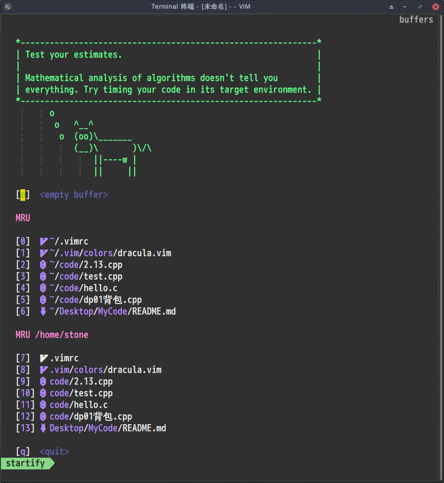

- 这个是没有开tree的界面




---

----

- 还没看过shell，所以不会写安装的脚本，只有先看着我的vimrc啦，等我学会的时候再来写一遍，抱歉！
- 只有一键编译错误的，没有设置一键运行，暂时没找到好的方案！

---

---


- 全部复制的方法:
  - 全部删除：按esc键后，先按gg（到达顶部），然后dG 
  - 全部复制：按esc键后，先按gg，然后ggyG 
  - 全选高亮显示：按esc键后，先按gg，然后ggvG或者ggVG
  - 单行复制：按esc键后, 然后yy 
  - 单行删除：按esc键后, 然后dd 
  - 粘贴：按esc键后, 然后p

```vim
:reg [register_name]       //可以查看指定寄存器
```


```vim
"+yy  // 复制当前行到剪切板 
"+p   // 将剪切板内容粘贴到光标后面 
"ayy  // 复制当前行到寄存器 
"ap   // 将寄存器 a 中的内容粘贴到光标后面
```


```vim
"nyw 复制当前单词到 n 号剪切板（双引号开始）  
"np 粘贴 n 号剪切板内容到当前位置后  
"+Y 复制当前行到系统剪切板 
"+nY 复制当前行往下 n 行到系统剪切板 
"+p 粘贴系统剪切板内容到当前位置后
```


- 插件快捷键

|  快捷键  |                 说明                  |
| :------: | :-----------------------------------: |
|   `|`    |             `Leader Key`              |
| `Ctrl+n` | 打开/关闭代码资源管理器(就是那个tree) |
|   `F5`   |             y一键编译c++              |
|  `F10`   |          关闭下面的运行信息           |
| `<c-p>` |          切换到上一个buffer           |
|  `<c-n>`|          切换到下一个buffer           |

- 缓存操作

|     快捷键      |        说明        |
| :-------------: | :----------------: |
| `:e <filename>` | 新建buffer打开文件 |
|      `:bp`      | 切换到上一个buffer |
|      `:bn`      | 切换到下一个buffer |
|      `:bd`      |   删除当前buffer   |

- 窗口操作

|      快捷键       |          说明          |
| :---------------: | :--------------------: |
| `:sp <filename>`  | 横向切分窗口并打开文件 |
| `:vsp <filename>` | 竖向切分窗口并打开文件 |
|     `<c-w>h`      |     跳到左边的窗口     |
|     `<c-w>j`      |     跳到下边的窗口     |
|     `<c-w>k`      |     跳到上边的窗口     |
|     `<c-w>l`      |     跳到右边的窗口     |
|     `<c-w>c`      |      关闭当前窗口      |
|     `<c-w>o`      |      关闭其他窗口      |
|      `:only`      |      关闭其他窗口      |

- 光标移动

| 快捷键  |                   说明                   |
| :-----: | :--------------------------------------: |
|   `h`   |               上下左右移动               |
|   `j`   |               上下左右移动               |
|   `k`   |               上下左右移动               |
|   `l`   |               上下左右移动               |
|   `0`   |              光标移动到行首              |
|   `^`   |      跳到从行首开始第一个非空白字符      |
|   `$`   |              光标移动到行尾              |
| `<c-o>` |              跳到上一个位置              |
| `<c-i>` |              跳到下一个位置              |
| `<c-b>` |                  上一页                  |
| `<c-f>` |                  下一页                  |
| `<c-u>` |                 上移半屏                 |
| `<c-d>` |                 下移半屏                 |
|   `H`   |               调到屏幕顶上               |
|   `M`   |               调到屏幕中间               |
|   `L`   |               调到屏幕下方               |
|  `:n`   |                跳到第n行                 |
|   `w`   | 跳到下一个单词开头(标点或空格分隔的单词) |
|   `W`   |    跳到下一个单词开头(空格分隔的单词)    |
|   `e`   | 跳到下一个单词尾部(标点或空格分隔的单词) |
|   `E`   |    跳到下一个单词尾部(空格分隔的单词)    |
|   `b`   |    上一个单词头(标点或空格分隔的单词)    |
|   `B`   |       上一个单词头(空格分隔的单词)       |
|  `ge`   |               上一个单词尾               |
|   `%`   |     在配对符间移动, 可用于()、{}、[]     |
|  `gg`   |                 到文件首                 |
|   `G`   |                 到文件尾                 |
|  `fx`   |          跳转到下一个为x的字符           |
|  `Fx`   |          跳转到上一个为x的字符           |
|  `tx`   |         跳转到下一个为x的字符前          |
|  `Tx`   |         跳转到上一个为x的字符前          |
|   `;`   |           跳到下一个搜索的结果           |
|  `[[`   |              跳转到函数开头              |
|  `]]`   |              跳转到函数结尾              |

- 文件操作

|        快捷键        |                  说明                  |
| :------------------: | :------------------------------------: |
|         `:w`         |                保存文件                |
|   `:w <filename>`    |             按名称保存文件             |
|         `ZZ`         | 保存文件（如果有改动的话），并关闭窗口 |
|   `:e <filename>`    |             打开文件并编辑             |
| `:saveas <filename>` |               另存为文件               |
|   `:r <filename>`    |      读取文件并将内容插入到光标后      |
|      `:r !dir`       |   将dir命令的输出捕获并插入到光标后    |
|       `:close`       |                关闭文件                |
|         `:q`         |                  退出                  |
|        `:q!`         |                强制退出                |
|        `:wa`         |              保存所有文件              |
|     `:cd <path>`     |            切换Vim当前路径             |
|        `:new`        |       打开一个新的窗口编辑新文件       |
|       `:enew`        |          在当前窗口创建新文件          |
|       `:vnew`        |     在左右切分的新窗口中编辑新文件     |
|      `:tabnew`       |        在新的标签页中编辑新文件        |

- 使用命令

| 快捷键               | 说明                                             |
| -------              | -----                                            |
| `/pattern`           | 从光标处向文件尾搜索 pattern                     |
| `?pattern`           | 从光标处向文件头搜索 pattern                     |
| `n`                  | 向同一方向执行上一次搜索                         |
| `N`                  | 向相反方向执行上一次搜索                         |
| `*`                  | 向前搜索光标下的单词                             |
| `#`                  | 向后搜索光标下的单词                             |
| `:s/p1/p2/g`         | 替换当前行的p1为p2                               |
| `:%s/p1/p2/g`        | 替换当前文件中的p1为p2                           |
| `:%s/<p1>/p2/g`      | 替换当前文件中的p1单词为p2                       |
| `:%s/p1/p2/gc`       | 替换当前文件中的p1为p2，并且每处询问你是否替换   |
| `:10,20s/p1/p2/g`    | 将第10到20行中所有p1替换为p2                     |
| `:%s/1\\2\/3/123/g`  | 将“1\2/3” 替换为 “123”（特殊字符使用反斜杠标注） |
| `:%s/\r//g`          | 删除 DOS 换行符 ^M                               |
| `:g/^\s*$/d`         | 删除空行                                         |
| `:g/test/d`          | 删除所有包含 test 的行                           |
| `:v/test/d`          | 删除所有不包含 test 的行                         |
| `:%s/^/test/`        | 在行首加入特定字符(也可以用宏录制来添加)         |
| `:%s/$/test/`        | 在行尾加入特定字符(也可以用宏录制来添加)         |
| `:sort`              | 排序                                             |
| `:g/^\(.\+\)$\n\1/d` | 去除重复行(先排序)                               |
| `:%s/^.\{10\}//`     | 删除每行前10个字符                               |
| `:%s/.\{10\}$//`     | 删除每行尾10个字符                               |

---

----
- 终端字体


----
---

- 插件及其设置由来：[vimplus](https://github.com/chxuan/vimplus)

- vim主题：[draculatheme](https://draculatheme.com/)
