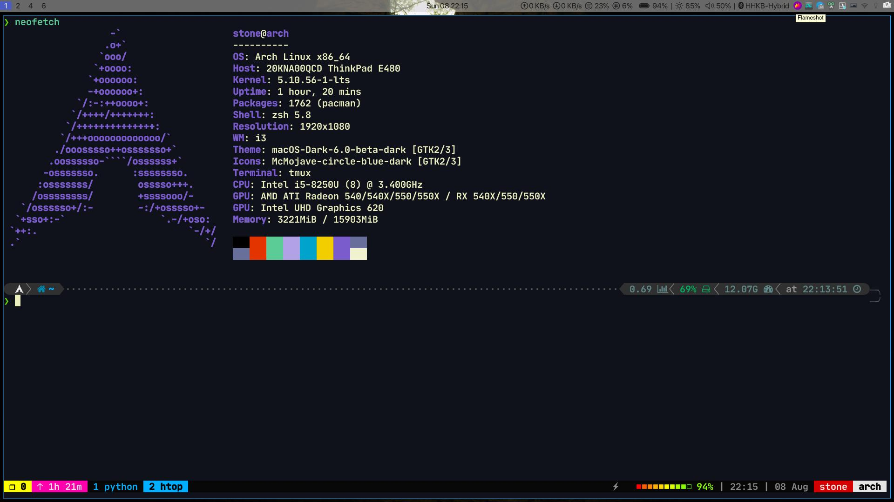
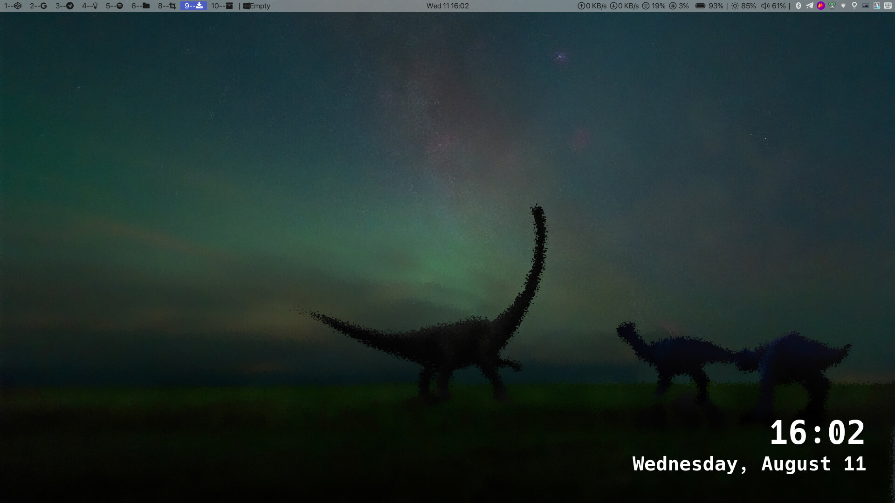

- `i3WM`

  - `i3-gaps`:两个软件可以空出空白
  - `i3lock-fancy`:锁屏
  - `rofi`:软件起动器
  - `iease-music`:网易云第三方客户端
  - `compton`:设置窗口半透明+毛玻璃(第三方更改的)
  - `dunst`:桌面通知(没有配置)
  - `copyq`:剪切板
  - `xfce4-power-manager  `:电源管理(好像不装也可以,不知道是不是因为我装了kde的原因)
  - `Thunar`,`PCManFM`:文件管理器
  - `mate-power-manager`:电源管理工具
  - `blueman-applet`:蓝牙托盘工具
  - `alsa-utils`:声音管理工具
  - `qt5ct`:设置qt主题
  - ` lxappearance`:设置`gtk`主题(好像是…)

  ---

  还有一些东西没有配置完成,等完成最近的考试再来慢慢配置

- Todo

- [x] `polybar`没有配置完成

- [x] `picom` 混成器

- [x] `rofi`

- [x] `Alacritty`

[参考](https://github.com/aeghn/prettyi3),不过我已经fork下来了,没做修改,留着备份

- 最终结果:

- 慢慢用着在添加配置吧!!!太难配置了,kde是真的好用,但是最近窗口老是卡死,先过渡到I3WM用一段时间试试!!!

---

可以查看下面链接进行详细配置:

1. https://zjuyk.gitlab.io/posts/i3wm-config/
2. https://wiki.archlinux.org/title/I3

可以从redhit上看别人配置好的文件,目前实在没有时间进行美化,polybar也没有配置完成,先用着kde过度.

- `polybar`参考配置文件:
  1. https://github.com/polybar/polybar
  2. https://github.com/NTBBloodbath/dotfiles
  3. https://github.com/abdheshnayak/dotfiles
  4. https://github.com/66RING/dotfiles
  5. https://github.com/pineapplegiant/spaceduck-terminal
  6. https://github.com/EvanMeek/dotfiles 
